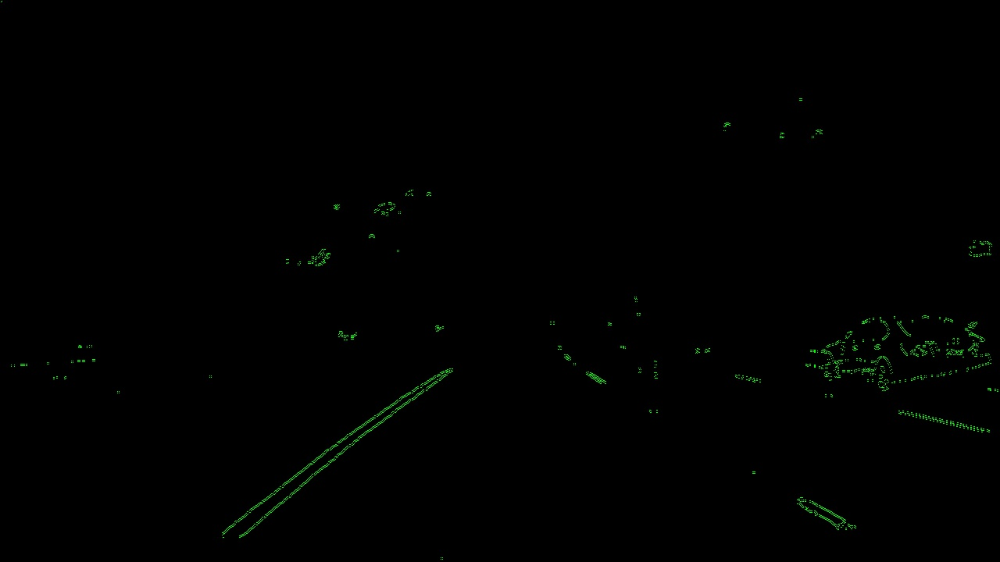
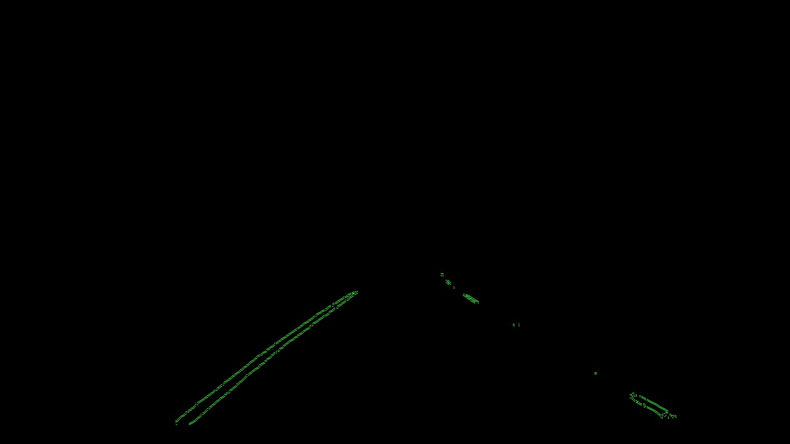
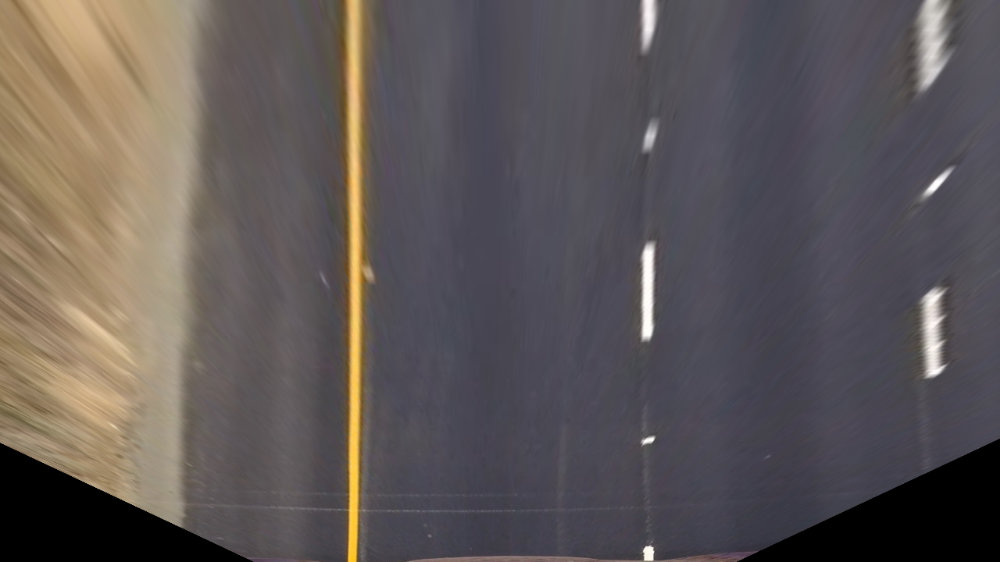
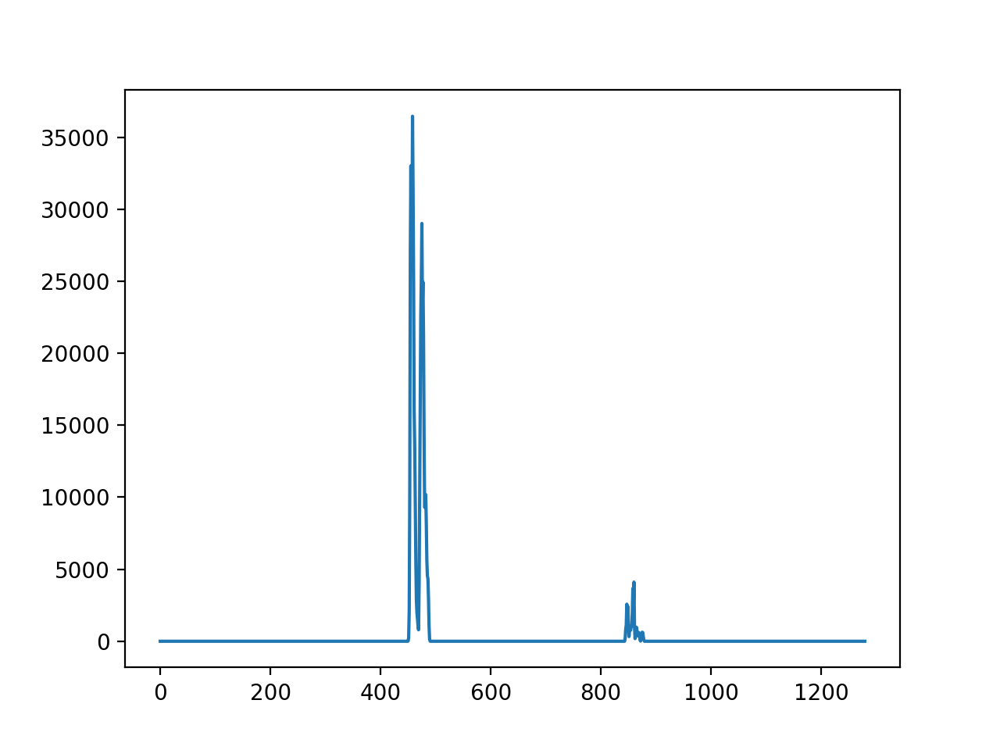
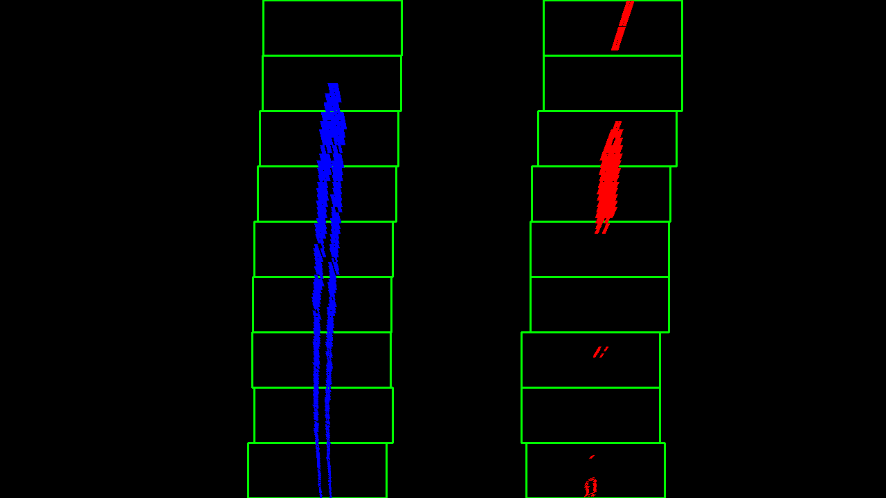
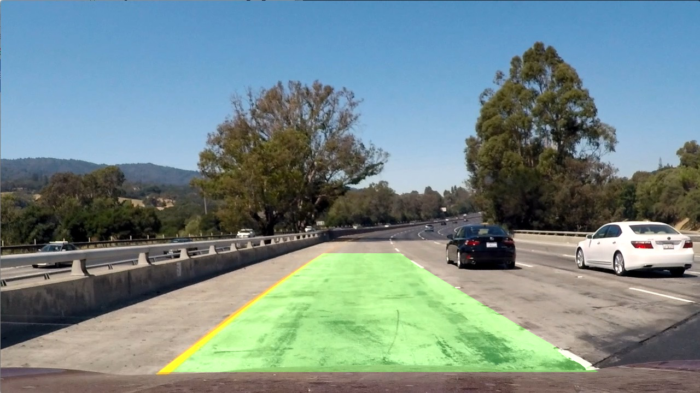

**Advanced Lane Finding Project**

The goals / steps of this project are the following:

* Compute the camera calibration matrix and distortion coefficients given a set of chessboard images.
* Apply a distortion correction to raw images.
* Use color transforms, gradients, etc., to create a thresholded binary image.
* Apply a perspective transform to rectify binary image ("birds-eye view").
* Detect lane pixels and fit to find the lane boundary.
* Determine the curvature of the lane and vehicle position with respect to center.
* Warp the detected lane boundaries back onto the original image.
* Output visual display of the lane boundaries and numerical estimation of lane curvature and vehicle position.

[//]: # (Image References)

[image1]: ./examples/undistort_output.png "Undistorted"
[image2]: ./test_images/test1.jpg "Road Transformed"
[image3]: ./examples/binary_combo_example.jpg "Binary Example"
[image4]: ./examples/warped_straight_lines.jpg "Warp Example"
[image5]: ./examples/color_fit_lines.jpg "Fit Visual"
[image6]: ./examples/example_output.jpg "Output"
[video1]: ./project_video.mp4 "Video"


---

### README

*All references in this readme to lines are for the file called `advanced_lane_finding_project.py`*


### Camera Calibration

#### 1. Camera matrix and distortion coefficients. Provide an example of a distortion corrected calibration image.

The code for this step is contained in lines 1 through 62. 

I start by preparing "object points", which will be the (x, y, z) coordinates of the chessboard corners in the world. Here I am assuming the chessboard is fixed on the (x, y) plane at z=0, such that the object points are the same for each calibration image.  Thus, `objp` is just a replicated array of coordinates, and `objpoints` will be appended with a copy of it every time I successfully detect all chessboard corners in a test image.  `imgpoints` will be appended with the (x, y) pixel position of each of the corners in the image plane with each successful chessboard detection.  

I then used the output `objpoints` and `imgpoints` to compute the camera calibration and distortion coefficients using the `cv2.calibrateCamera()` function.  I applied this distortion correction to the test image using the `cv2.undistort()` function and obtained this result: 

Original Image             |  Undistort Image
:-------------------------:|:-------------------------:
|  


### Pipeline (single images)

#### 1. Color transforms , gradients or other methods to create a thresholded binary image.  

I used a combination of color and gradient thresholds to generate a binary image (thresholding steps at lines 86 through 112, lines 141 to 193). I pick b channel of LAB color space to capture yellow lines (see lines 86 through 98) and the l channel in HLS color space to capture white lines (see line 101 through 112)

I apply a triangle shape mask to capture the area directly in front of the car. This makes intuitive sense as the car is supposed to stay on its own lanes. Situational awareness of lanes that car is not driving on is important but is beyond the scope of this project. The code for this step is 

Here's an example of my output for this step. 

Original Image             |Color Transform &Gradient  |Region of interest mask   |
:-------------------------:|:-------------------------:|-------------------------:|
      |   | 

#### 3. Perspective transform.

The code for my perspective transform includes a function called `warp(img, src, dst)`, which appears in lines 284 through 287.  The `warper()` function takes as inputs an image (`img`), as well as source (`src`) and destination (`dst`) points.  I chose the hardcode the source and destination points in the following manner:

```python
src = np.float32([(575,464),
                  (707,464),
                  (258,682),
                  (1049,682)])
dst = np.float32([(450,0),
                  (width-450,0),
                  (450,height),
                  (width-450,height)])
```


I verified that my perspective transform was working as expected by drawing the `src` and `dst` points onto a test image and its warped counterpart to verify that the lines appear parallel in the warped image.


Original Image             |  Warped Image
:-------------------------:|:-------------------------:
|  


#### 4. Identifying lane-line pixels and fit their positions with a polynomial

Refer function find_lines() and def find_lane_based_on_previous_frame() - lines 321 through 552. 


#### 5. Radius of curvature of the lane and the position of the vehicle with respect to center.

Refer lines 414 to 442

#### 6. An example image of my result plotted back down onto the road such that the lane area is identified clearly.

Original Image             |Histogram for lanes        |Sliding Windows to identify lanes  |
:-------------------------:|:-------------------------:|-------------------------:|
      |   | 

Plotted on road             |  
:-------------------------:|
|  

---

### Pipeline (video)

#### 1. Provide a link to your final video output.  Your pipeline should perform reasonably well on the entire project video (wobbly lines are ok but no catastrophic failures that would cause the car to drive off the road!).

Here's a [link to my video result](video./project_video.mp4)

---

### Discussion

#### 1. Briefly discuss any problems / issues you faced in your implementation of this project.  Where will your pipeline likely fail?  What could you do to make it more robust?

I think the pipeline might fail when the lanes are marked in colors other than yellow and light. A solution to this is to include filters to identify more colors. 

In addition, if the lanes are not directly in front of the car the pipeline may fail too.  
